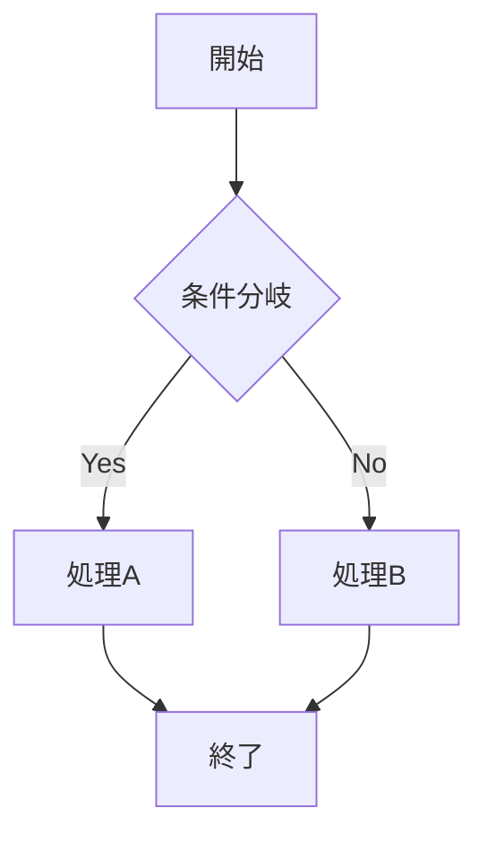

# Mermaid.js ダイアグラム描画機能 実装計画

## 概要

MDX記事内の ` ```mermaid ` コードブロックを、Mermaid.jsでSVGダイアグラムとして描画する機能を追加する。ライトモード・ダークモード両対応。

## 現状分析

### MDX処理パイプライン (`src/lib/mdx.tsx`)

```
MDXファイル (_posts/*.mdx)
  → gray-matter（フロントマター抽出）
  → @mdx-js/mdx compile()（rehypeプラグインチェーン適用）
  → @mdx-js/mdx run()（React要素生成）
  → CustomMDXComponents 注入
  → React.ReactElement
```

**rehypeプラグインチェーン（処理順）:**
1. `rehype-code-titles` - コードブロックタイトル抽出
2. `rehypeShikiFromHighlighter` - Shikiシンタックスハイライト（Night Owlテーマ）
3. `rehype-slug` - 見出しID付与
4. `rehypeExtractHeadings` - 見出し情報抽出
5. `rehype-autolink-headings` - 見出しアンカーリンク

### コードブロックの処理フロー

1. MDXの ` ```lang ` がrehypeのAST上で `<pre><code class="language-lang">` に変換される
2. Shikiが `language-*` クラスを検知し、トークン化・スタイル適用
3. `CustomMDXComponents.pre` でTailwindクラス付与

### ダークモード (`src/contexts/ThemeContext.tsx`)

- `<html data-theme="light|dark">` 属性ベースで切り替え
- `useTheme()` フックで `resolvedTheme: 'light' | 'dark'` を取得可能
- Tailwind CSSの `dark:` バリアントは `[data-theme="dark"]` にマッピング

---

## アプローチ比較

### A. クライアントサイドレンダリング（推奨）

`mermaid` パッケージをブラウザで動的にimportし、`useEffect`でSVGを描画する。

**メリット:**
- Playwright等のビルド時依存なし（Vercelデプロイに影響なし）
- テーマ切り替え時にダイアグラムを再描画できる（動的ダークモード対応）
- 既存のrehypeパイプラインへの変更が少ない
- Next.js App Router / RSCとの互換性が高い

**デメリット:**
- mermaidライブラリが大きい（~2MB+ minified）→ 動的importで緩和
- 初回表示時にローディング状態が発生する（JSロード→描画）
- 図の内容が初期HTMLに含まれない（SEO的にはブログ図表なので影響は軽微）

### B. ビルドタイムレンダリング（rehype-mermaid + Playwright）

`rehype-mermaid` をrehypeプラグインチェーンに追加し、ビルド時にSVGを生成する。

**メリット:**
- クライアントにmermaidを配信しない（バンドルサイズゼロ）
- 初期HTMLにSVGが含まれる（レイアウトシフトなし）

**デメリット:**
- Playwright（+Chromium ~200MB+）のビルド環境依存
- Vercelビルド環境でのPlaywright設定が必要
- ダークモード対応が `<picture>` + `prefers-color-scheme` に限定（`data-theme`ベースの切り替えと不整合）
- Next.jsバンドラーが `fs` モジュール解決エラーを起こす既知問題あり
- ビルド時間増加

### 結論: **アプローチA（クライアントサイドレンダリング）を採用**

理由:
1. Vercelデプロイの安定性（追加依存なし）
2. 既存の`data-theme`ベースのダークモードとシームレスに統合可能
3. 実装がシンプルで保守しやすい
4. バンドルサイズは`next/dynamic`の遅延読み込みで軽減可能

---

## 実装計画

### 概要

2つのアプローチを組み合わせる:

1. **rehypeプラグイン**で `language-mermaid` コードブロックをShikiのハイライト対象から除外し、Mermaidコンポーネント呼び出しに変換
2. **クライアントコンポーネント**で `mermaid` ライブラリを動的importし、SVG描画・テーマ連動を担当

### Step 1: パッケージインストール

```bash
pnpm add mermaid
```

### Step 2: rehypeプラグイン作成 — `src/lib/rehype-mermaid.ts`

mermaidコードブロックをShikiのハイライト処理から除外し、カスタムコンポーネントとして出力するためのrehypeプラグインを作成する。

**動作:**
- ASTを走査し、`<code class="language-mermaid">` を持つ `<pre>` 要素を検出
- 該当要素を `<Mermaid chart="..." />` に相当するMDXコンポーネント呼び出しに書き換え
- Shikiプラグインより**前**にチェーンに配置し、mermaidブロックがハイライトされないようにする

**実装案:**
```typescript
// src/lib/rehype-mermaid.ts
import type { Element, Root, Text } from 'hast';
import { visit } from 'unist-util-visit';

export function rehypeMermaid() {
  return (tree: Root) => {
    visit(tree, 'element', (node: Element, index, parent) => {
      // <pre><code class="language-mermaid"> を検出
      if (node.tagName !== 'pre' || !parent || index === undefined) return;
      const codeEl = node.children.find(
        (child): child is Element =>
          child.type === 'element' && child.tagName === 'code',
      );
      if (!codeEl) return;

      const className = codeEl.properties?.className;
      if (
        !Array.isArray(className) ||
        !className.includes('language-mermaid')
      ) {
        return;
      }

      // コードブロックの中身（mermaid記法テキスト）を取得
      const chart = codeEl.children
        .filter((c): c is Text => c.type === 'text')
        .map((c) => c.value)
        .join('');

      // <pre> を Mermaid コンポーネント呼び出しに置換
      // MDXJsEsm/MDXFlowExpression 等ではなく、
      // JSX要素として出力する（mdx-js が認識する形）
      parent.children[index] = {
        type: 'element',
        tagName: 'MermaidDiagram',
        properties: { chart },
        children: [],
      };
    });
  };
}
```

**注意:** MDXの`compile`/`run`パイプラインでは、`CustomMDXComponents` にキーを追加すればカスタムHTML要素名をReactコンポーネントにマッピングできる。`MermaidDiagram` タグ名を使い、`CustomMDXComponents` で対応するクライアントコンポーネントに接続する。

### Step 3: Mermaidクライアントコンポーネント作成 — `src/components/MermaidDiagram.tsx`

**責務:**
- `mermaid` ライブラリの動的import
- `useTheme()` でテーマ取得 → Mermaidテーマ設定
- SVG描画・再描画（テーマ変更時）
- ローディング状態の表示

**実装案:**
```typescript
// src/components/MermaidDiagram.tsx
'use client';

import { useEffect, useId, useRef, useState } from 'react';
import { useTheme } from '@/contexts/ThemeContext';

type MermaidDiagramProps = {
  chart: string;
};

export function MermaidDiagram({ chart }: MermaidDiagramProps) {
  const containerRef = useRef<HTMLDivElement>(null);
  const { resolvedTheme } = useTheme();
  const [svg, setSvg] = useState<string>('');
  const [isLoading, setIsLoading] = useState(true);
  const id = useId();
  // useIdの `:` はDOM IDとして不適切なので置換
  const diagramId = `mermaid-${id.replace(/:/g, '')}`;

  useEffect(() => {
    let cancelled = false;

    const renderDiagram = async () => {
      const mermaid = (await import('mermaid')).default;
      mermaid.initialize({
        startOnLoad: false,
        theme: resolvedTheme === 'dark' ? 'dark' : 'default',
        // フォント設定（サイト全体のフォントに合わせる）
        fontFamily: 'inherit',
      });

      try {
        const { svg: renderedSvg } = await mermaid.render(
          diagramId,
          chart,
        );
        if (!cancelled) {
          setSvg(renderedSvg);
          setIsLoading(false);
        }
      } catch (error) {
        console.error('Mermaid rendering error:', error);
        if (!cancelled) {
          setIsLoading(false);
        }
      }
    };

    renderDiagram();
    return () => { cancelled = true; };
  }, [chart, resolvedTheme, diagramId]);

  if (isLoading) {
    return (
      <div className="mb-6 flex items-center justify-center rounded-md border border-gray-200 dark:border-gray-700 bg-gray-50 dark:bg-gray-800 p-8">
        <span className="text-gray-400 dark:text-gray-500 text-sm">
          Loading diagram...
        </span>
      </div>
    );
  }

  return (
    <div
      ref={containerRef}
      className="mb-6 flex justify-center overflow-x-auto rounded-md border border-gray-200 dark:border-gray-700 bg-white dark:bg-gray-900 p-4 [&>svg]:max-w-full"
      // biome-ignore lint: SVG output from mermaid
      dangerouslySetInnerHTML={{ __html: svg }}
    />
  );
}
```

**ポイント:**
- `useTheme()` の `resolvedTheme` を `useEffect` の依存配列に入れることで、テーマ切り替え時に自動再描画
- `mermaid.render()` はユニークなIDが必要 → `useId()` で生成
- ローディング中はスケルトン的なプレースホルダを表示
- エラー時はフォールバック表示（またはコードブロックをそのまま表示）
- コンテナに `overflow-x-auto` で大きい図のスクロール対応

### Step 4: MDXコンポーネント登録 — `src/components/MDXComponent.tsx` 修正

```diff
+ import { MermaidDiagram } from '@/components/MermaidDiagram';

  export const CustomMDXComponents: MDXComponents = {
    // ...既存コンポーネント
+   MermaidDiagram,
  };
```

`MermaidDiagram` は `'use client'` コンポーネントだが、`CustomMDXComponents` のオブジェクトに含めるだけなので問題ない。MDXの `run()` 実行結果が `<MermaidDiagram>` 要素を含む場合、React側で自動的にクライアントコンポーネントとして扱われる。

### Step 5: rehypeプラグインチェーン修正 — `src/lib/mdx.tsx` 修正

```diff
+ import { rehypeMermaid } from './rehype-mermaid';

  const vfile = await compile(mdxContent, {
    outputFormat: 'function-body',
    development: process.env.NODE_ENV === 'development',
    rehypePlugins: [
      rehypeCodeTitles,
+     rehypeMermaid,  // Shikiの前に配置（mermaidブロックを除外するため）
      [
        rehypeShikiFromHighlighter,
        // ...
      ],
      // ...
    ],
  });
```

**配置順の根拠:** `rehypeMermaid` が `<pre><code class="language-mermaid">` を `<MermaidDiagram>` に変換した後、Shikiプラグインが処理する。Shikiは既に `<pre><code>` でなくなったmermaidブロックをスキップする。

### Step 6: スタイル調整 — `src/styles/styles.css`

```css
/* Mermaid diagram container */
.mermaid-diagram svg {
  max-width: 100%;
  height: auto;
}
```

基本的にはTailwindクラスで対応するが、Mermaid生成SVGの内部要素に対する微調整が必要な場合にCSSを追加。

---

## ファイル変更一覧

| ファイル | 変更種別 | 内容 |
|---|---|---|
| `package.json` | 修正 | `mermaid` パッケージ追加 |
| `src/lib/rehype-mermaid.ts` | 新規 | mermaidコードブロックをコンポーネントに変換するrehypeプラグイン |
| `src/components/MermaidDiagram.tsx` | 新規 | Mermaid描画クライアントコンポーネント（テーマ連動） |
| `src/components/MDXComponent.tsx` | 修正 | `MermaidDiagram` をカスタムコンポーネントに登録 |
| `src/lib/mdx.tsx` | 修正 | `rehypeMermaid` をプラグインチェーンに追加 |
| `src/styles/styles.css` | 修正（必要に応じて） | Mermaid SVG用のスタイル微調整 |

---

## テーマ対応の詳細

### Mermaid組み込みテーマ

| テーマ名 | 用途 |
|---|---|
| `default` | ライトモード用（青/グレー基調） |
| `dark` | ダークモード用（暗背景・明るいテキスト） |
| `neutral` | グレースケール |
| `forest` | 緑基調 |
| `base` | カスタマイズ可能 |

### テーマ切り替えフロー

```
ユーザーがThemeToggleクリック
  → ThemeContext の resolvedTheme が変更
  → MermaidDiagram の useEffect が再実行
  → mermaid.initialize() を新テーマで呼び出し
  → mermaid.render() でSVGを再生成
  → setState でDOMを更新
```

### マッピング

| サイトテーマ (`resolvedTheme`) | Mermaidテーマ |
|---|---|
| `'light'` | `'default'` |
| `'dark'` | `'dark'` |

---

## 記事内での使い方

記事作者は通常のコードブロック記法で記述する:

````markdown

````

特別なインポートや設定は不要。ライト/ダークモードの切り替えは自動で反映される。

---

## バンドルサイズへの影響と対策

### 懸念

- `mermaid` パッケージは minified で約2MB+
- D3.js, dagre, ELK等の依存が大きい

### 対策

1. **動的import**: `import('mermaid')` を `useEffect` 内で実行し、初期バンドルに含めない
2. **遅延ロード**: mermaidコードブロックを含む記事ページでのみロードされる
3. **チャンク分離**: Next.jsが自動的に別チャンクとして分離

### バンドルサイズ予算との関係

- 現在の予算: 358KB
- mermaidは動的importのため初期バンドルには含まれない
- `pnpm build:analyze` で実際の影響を確認する必要がある

---

## 実装の検証手順

1. `pnpm dev` で開発サーバー起動
2. テスト用MDX記事にmermaidコードブロックを追加
3. ブラウザでダイアグラムの描画を確認
4. ライト/ダークモード切り替え時の再描画を確認
5. 大きいダイアグラムのスクロール対応を確認
6. `pnpm lint && pnpm format && pnpm typecheck` 通過確認
7. `pnpm build` 成功確認
8. `pnpm build:analyze` でバンドルサイズ確認

---

## リスクと注意点

1. **mermaid.render()のID重複**: 同一ページに複数ダイアグラムがある場合、`useId()`で一意性を保証
2. **SSRエラー**: `'use client'` + `useEffect`内の動的importにより回避
3. **React Compiler互換性**: `next.config.ts` で `reactCompiler: true` が有効。`useRef`/`useEffect`パターンは互換性あり
4. **mermaidの初期化競合**: 複数ダイアグラムが同時にinitialize()を呼ぶ場合 → `mermaid.render()`は内部的に安全に処理される（各呼び出しが独立したSVGを返す）
5. **rehype-code-titlesとの干渉**: mermaidブロックにタイトルが付いている場合（` ```mermaid:title `）、`rehype-code-titles` が先に処理される。`rehypeMermaid`プラグインで対応が必要になる可能性がある
